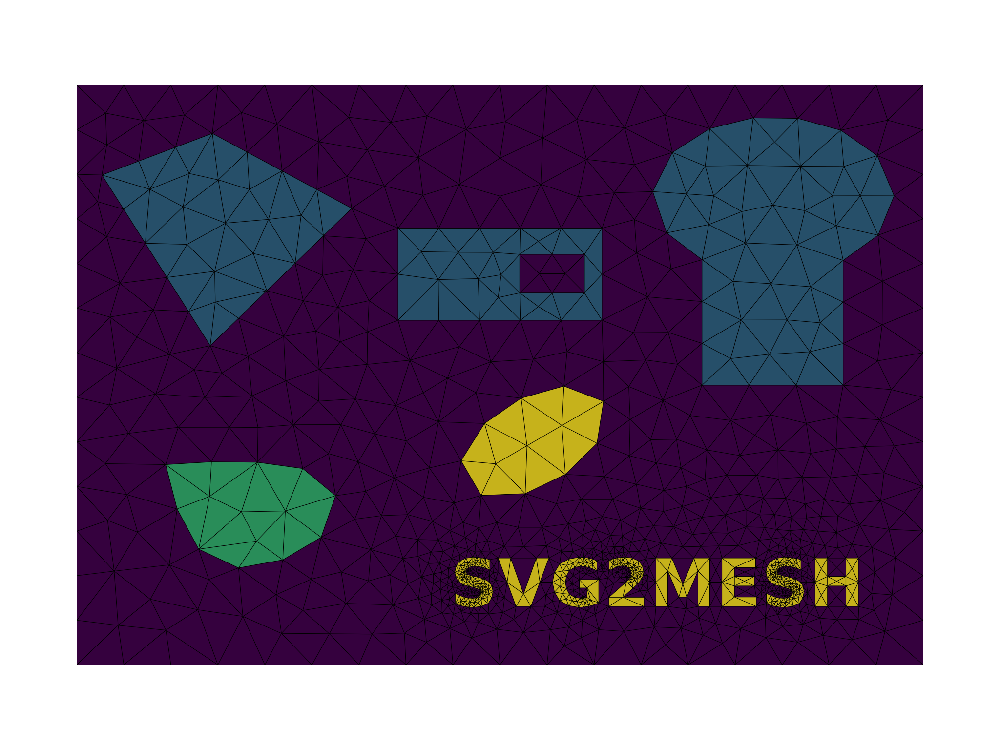
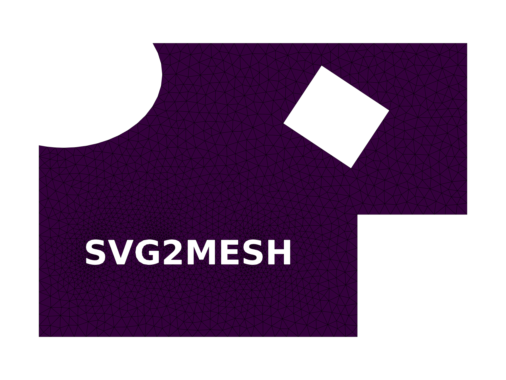
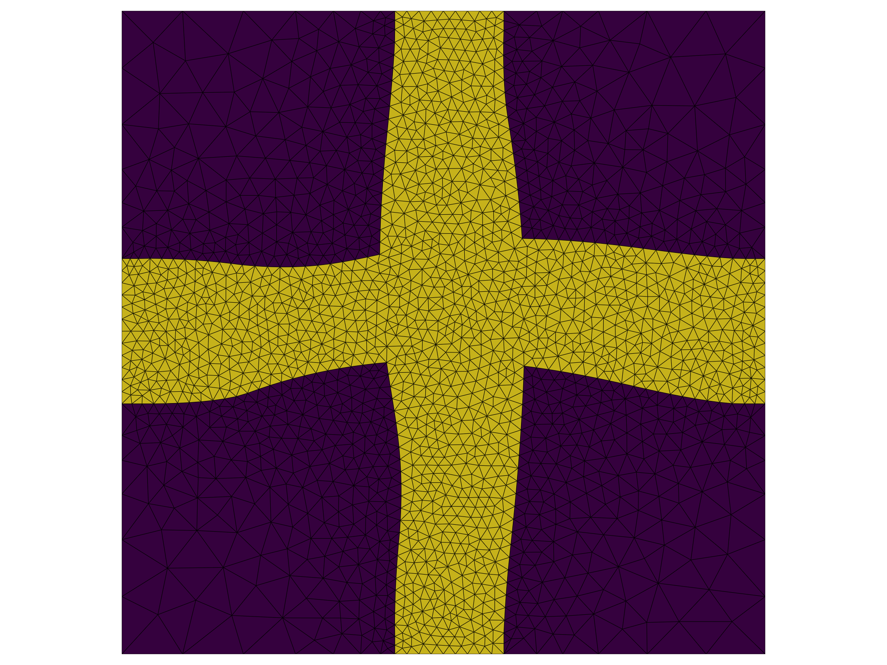

# SVG2mesh

Generate finite element meshes from SVG-defined geometry.

SVG2mesh converts 2D geometries stored in SVG files into finite element meshes
using Gmsh. The generated mesh can be exported to formats supported by MeshIO
and used in finite element analysis and scientific computing workflows.

## Features

- Create FE meshes directly from SVG geometry
- Mesh generation powered by Gmsh
- Export meshes through MeshIO
- Optional generation of periodic meshes
- Export geometry preview as PNG

## Installation

### Requirements

- Python 3.8+
- NumPy
- Gmsh
- MeshIO
- svgelements

### Install from Source

```bash
git clone https://github.com/sfepy/svg2mesh.git
cd svg2mesh
pip install .
```

### Install form PyPI

```bash
pip install svg2mesh
```

## Usage

### Basic Usage

```bash
svg2mesh geometry.svg
```

### Specify Output File

```bash
svg2mesh geometry.svg -o mesh.vtk
```

### Generate Unit Cell Mesh

```bash
svg2mesh geometry.svg -u
```

### Generate Periodic Mesh

```bash
svg2mesh geometry.svg -p
```

### Control Mesh Size

```bash
svg2mesh geometry.svg -s 0.05
```

### Export PNG Preview

```bash
svg2mesh geometry.svg -e
```

## Input Geometry

The input geometry must be provided as a **plain** SVG file.

Each physical (material) group must be defined in a separate SVG group labeled `layer1`, `layer2`, `layer3`, and so on. These layers are used to identify individual material regions in the generated mesh.

All SVG objects should be defined as paths.


## Examples

### Mesh1 -- multimaterial part

```bash
svg2mesh mesh1.svg -s 10
```


### Mesh2 -- single material part

```bash
svg2mesh mesh2.svg -s 5
```


### Mesh3 -- periodic unit cell

```bash
svg2mesh mesh3.svg -u -s "[10, 2]"
```


## License

SVG2mesh is distributed under the MIT License.

See the `LICENSE` file for details.